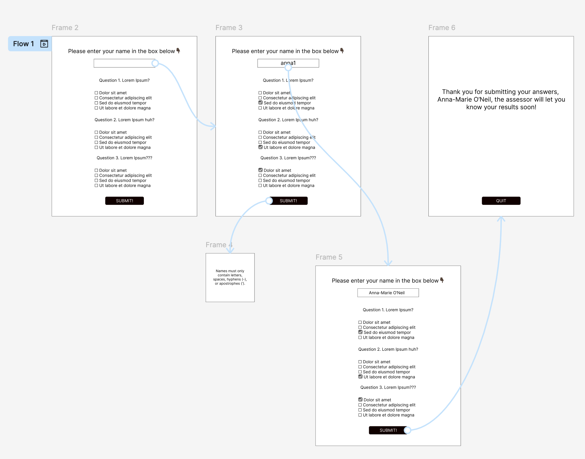

# History Quiz App

## Introduction

This History Quiz App is a minimum viable product (MVP) developed for the TEACHER TEACHING COLLECTIVE, an organisation that delivers teacher education and training. As part of its enrolment process, TEACHER TEACHING COLLECTIVE requires a simple and consistent way to assess whether prospective applicants have sufficient baseline subject knowledge before enrolling on a history teacher training course.

The History Quiz App is a desktop application built using [Python](https://docs.python.org/3/) and [Tkinter](https://docs.python.org/3/library/tkinter.html). It collects a participant’s name and their answers to a set of single-answer multiple-choice history questions. The app is intended to function as a short screening test rather than a teaching tool, supporting staff in making informed decisions about course enrolment.

Before submission, the participant’s name is cleaned and checked against specific validation rules. If any rule is not met, the app displays an error message and prevents submission. This ensures that stored records are clear, consistent, and suitable for later review. When the input is valid, the participant’s name, selected answers, and a timestamp are written to a [CSV file](https://docs.python.org/3/library/csv.html). This storage format aligns with existing workplace practices, as CSV files can be easily accessed, transferred between applications, and processed using standard software, such as [MS Excel](https://www.microsoft.com/en-gb/microsoft-365/excel) or [Google Sheets](https://developers.google.com/workspace/sheets), without the need for additional systems.

The application does not calculate or display a score to the participant. This is intentional, as the quiz is used to support enrolment decisions rather than to provide immediate feedback. Responses are reviewed separately by TEACHER TEACHING COLLECTIVE staff, who determine whether an applicant should be permitted to enrol on the history teacher course.

As an MVP, the app focuses on essential functionality: input collection, validation, and data storage. Features such as result calculation, data visualisation, and differentiated access levels are out of scope at this stage. This limited scope makes it suitable for early deployment and future refinement based on organisational needs. 

## Design

**Figure 1** shows the wireframe used during the early design stage of the application. The wireframe represents the intended user journey through the quiz, from entering a name and answering questions to submitting responses and reaching the confirmation screen.

The wireframe was used to plan screen layout, validation points, and navigation flow before implementation. It does not represent the final visual appearance of the application, but instead focuses on structure, sequence, and user interaction.

**Figure 1:** Wireframe

## Development

## Testing

## 

